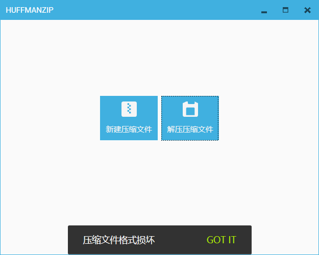

# HuffmanZip实验报告

- **姓名**：魏剑宇
- **学号**：PB17111586
- **代码**：[我的数据结构GitHub Repo](https://github.com/kaleid-liner/DataStructure)

## 实验要求

1. 用huffman压缩技术实现对任意文件的压缩和解压缩处理。
2. 要求对所有的文件类型进行压缩，压缩之后的文件后缀名为huff。
3. 同时，可以对所有后缀名为huff的压缩文件进行解压缩。

## 实验内容

**实验题目**：HuffmanZip

**实验内容**：

1. 确定文件的存储结构。文件开头使用一个byte作为文件的magic number，用于标识文件的格式，表示这是一个HuffmanZip文件。之后一个byte存储padding。之后256 * 4个字节以uint32存储文件中每个byte出现的频率。之后所有的空间存储编码后的原文件数据内容。
2. Encode时读取原文件后基于原文件的内容得到频率后，以频率构建Huffman树。在Decode时读取文件Header并以频率构建Huffman树，两次构建的树应是相同的。
3. 树提供接口编码和解码。此时提供树一个byte，能得到其编码，提供bit流，能得到原来的码文。
4. 实现GUI，能选择文件进行压缩和解压缩。在成功和出错时能给予用户提示。

实现效果大致如下



## 实验关键代码描述

代码通过c#实现，基于.NET Framework 4.7.1。基于[WPF(Windows Presentation Foundation)](https://docs.microsoft.com/en-us/dotnet/framework/wpf/)实现GUI，采用MVVM模型，GUI样式采用[Material Design](https://github.com/MaterialDesignInXAML/)，部分控件采用[MahApps](https://github.com/MahApps/)。代码位于[我的数据结构GitHub Repo](https://github.com/kaleid-liner/DataStructure)。

### ENCODE

通过`byte[] bytes = File.ReadAllBytes(sourceFilePath)`读取原文件后，统计每种byte出现的频率，构建Huffman树。

```csharp
public HuffmanTree(uint[] frequency)
{
    tree = new HuffmanNode[frequency.Length * 2 - 1];
    for (int i = 0; i < frequency.Length; i++)
    {
        tree[i].weight = frequency[i];
        tree[i].left = tree[i].right = i;
    }
    Encoding();
    currentNode = tree.Length - 1;
}
```

`Encoding`是一个helper方法，它使用了一个堆，来实现高效地选取当前频率最高的两个节点。Encoding后得到了所有byte的编码，并构建起Huffman树。

Encode时通过magic number标识文件格式
```csharp
enum MagicNumber : int { Compressed = 114514, UnCompressed = 19260817 }
```

之后对每个byte进行编码，代码如下

```csharp
byte bitBuffer = 0;
int usedBit = 0;
foreach (byte currentByte in remainingBytes)
{
    string bcode = codeTree[currentByte];
    foreach (char c in bcode)
    {
        if (c == '1')
        {
            bitBuffer = (byte)(bitBuffer | (1 << usedBit));
        }
        usedBit++;
        if (usedBit == 8)
        {
            code.Add(bitBuffer);
            usedBit = 0;
            bitBuffer = 0;
        }
    }
}
```

从huffmantree中得到code后，将其存入bitBuffer中，并用usedBit标识bitBuffer中已使用的位数。这也将用于得到最后的padding。

若最后编码得出的码长大于原来的，保留原文件并插入magic number。这样可以避免将文件压大。

### DECODE

分析文件的header后进行，得到magic number和padding，之后即可进行decode。

```csharp
public IEnumerable<byte> DecodeBytes(byte[] bytes)
{
    if (magic == MagicNumber.UnCompressed)
        return bytes;
    List<byte> origBytes = new List<byte>();
    for (int i = 0; i < bytes.Length - 1; i++)
    {
        byte b = bytes[i];
        for (int j = 0; j < 8; j++)
        {
            int orig = codeTree.Next(b & 1);
            if (orig != -1)
                origBytes.Add((byte)orig);
            b >>= 1;
        }
    }
    byte rear = bytes.Last();
    for (int j = 0; j < 8 - padding; j++)
    {
        int orig = codeTree.Next(rear & 1);
        if (orig != -1)
            origBytes.Add((byte)orig);
        rear >>= 1;
    }
    return origBytes;
}
```

若文件标识为未压缩，则不用进行任何处理。否则，一位一位地进行解码，并对文件末尾的padding进行特殊处理。最后即可得到原码。

### 用户界面

用户界面由两个`Tile`（分别用于压缩和解压的按钮）和一个`Snackbar`组成，Snackbar用于向用户提供有用的信息。

```xaml
<Grid>
        <StackPanel Orientation="Vertical" HorizontalAlignment="Center" 					VerticalAlignment="Center">
            <StackPanel Orientation="Horizontal" HorizontalAlignment="Center" 					VerticalAlignment="Center">
                <mahApps:Tile Height="70" Width="90" Click="ZipClickAsync" 		Foreground="WhiteSmoke">
                    <StackPanel Orientation="Vertical">
                        <materialDesign:PackIcon Kind="ZipBox" HorizontalAlignment="Center" 
                                         Width="32" Height="32"/>
                        <TextBlock Text="新建压缩文件" Margin="0, 8, 0, 5"/>
                    </StackPanel>
                </mahApps:Tile>
                <mahApps:Tile Height="70" Width="90" Click="UnzipClickAsync" Foreground="WhiteSmoke">
                    <StackPanel Orientation="Vertical">
                        <materialDesign:PackIcon Kind="ZipDisk" HorizontalAlignment="Center"
                                         Width="32" Height="32" />
                        <TextBlock Text="解压压缩文件" Margin="0, 8, 0, 5"/>
                    </StackPanel>
                </mahApps:Tile>
            </StackPanel>
            <ProgressBar x:Name="progressIndicator" Style="{StaticResource MaterialDesignCircularProgressBar}" 
                         Value="0" IsIndeterminate="True" Margin="0, 20" Visibility="Hidden"/>
        </StackPanel>
        <materialDesign:Snackbar x:Name="tipsSnackBar" MessageQueue="{materialDesign:MessageQueue}" />
        
</Grid>
```

## 实验小结

- 此次实验较为简单，通过C#能较为轻松的实现。
- 通过这次实验，熟练地掌握了huffman编码的原理和写法。
- 并构建用户友好的界面。